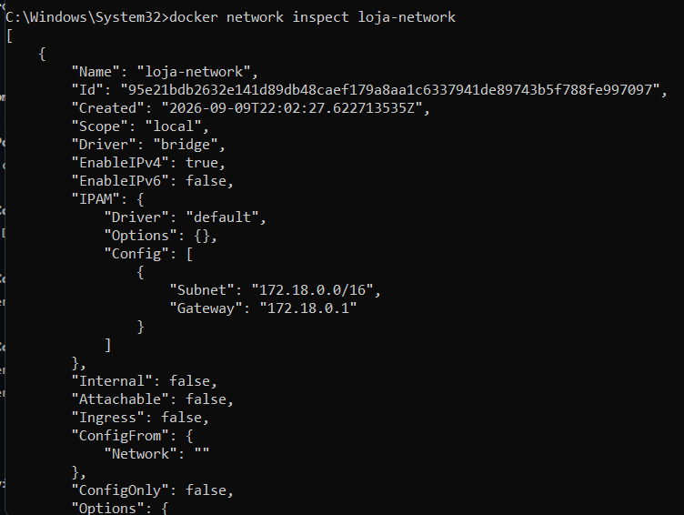
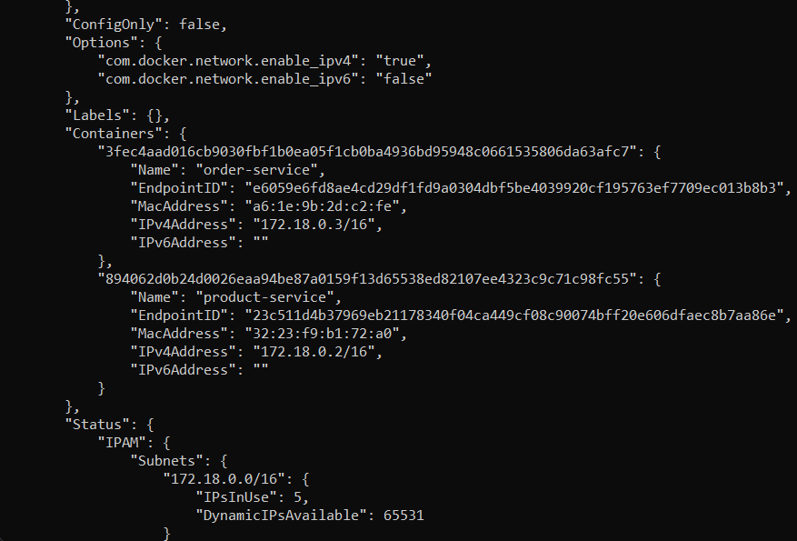
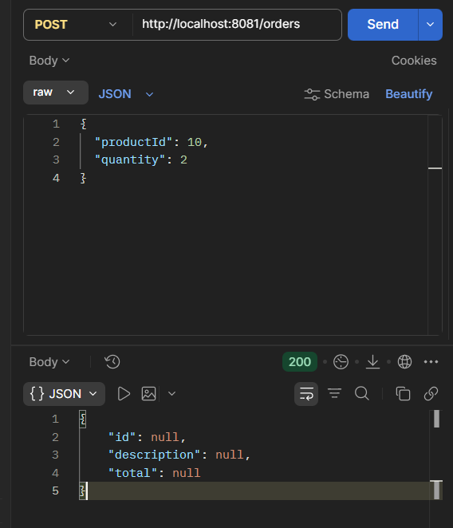

# Microsserviços e DevOps com Spring Boot e Kubernetes
## Arquitetura Proposta
### Visão Geral
O sistema consiste em uma Loja Virtual desenvolvida utilizando uma arquitetura baseada em microsserviços.
O objetivo é demonstrar, de forma progressiva, a evolução de uma aplicação desde a execução em containers Docker até sua orquestração no Kubernetes.

A aplicação inicial será composta por dois microsserviços independentes, cada um responsável por um domínio específico do negócio, permitindo escalabilidade e separação de responsabilidades.

---

## Microsserviços
### product-service
Responsabilidade: Gerenciar os produtos disponíveis na loja.

### Principais dados manipulados:
Produto (nome, descrição, preço, estoque)

### Principais funcionalidades:

1. Cadastro de produtos
2. Consulta de produtos
3. Atualização de informações de produtos
4. Remoção de produtos
5. Busca por nome e faixa de preço

### Banco de dados: H2 (Relacional)
Justificativa: Os dados de produtos possuem estrutura rígida e relacional, sendo adequados para um banco relacional simples.

---

### order-service
Responsabilidade: Gerenciar os pedidos realizados pelos clientes.

### Principais dados manipulados:
Pedido (itens, quantidade, valor total, status)

Principais funcionalidades:

1. Criação de pedidos
2. Consulta de pedidos
3. Atualização de status de pedidos
4. Remoção de pedidos
5. Consulta de histórico de pedidos

### Banco de dados: H2 (Relacional)
Justificativa: Os dados de pedidos possuem estrutura bem definida e relacionamentos diretos com produtos, sendo adequados para um banco relacional.

---

## Objetivo do Projeto
Demonstrar:

1. Diferença entre máquina virtual e container
2. Utilização do Docker
3. Containers executando microsserviços
4. Comunicação entre containers
5. Uso do Docker Compose
6. Migração para Kubernetes
7. Deploy de aplicações Spring Boot
8. Service Discovery
9. Balanceamento de carga

---

## Perguntas do exercício 2

### a) Como seria executar essa aplicação utilizando uma máquina virtual?
R: Seria necessária a criação de uma VM, instalar um sistema operacional completo, configurar dependências e rodar a aplicação dentro dela.

### b) Como seria executar utilizando containers?
R: Criar uma imagem Docker com a aplicação e rodar em qualquer máquina com Docker instalado, sem precisar de um sistema operacional completo.

### c) Qual solução tende a consumir menos recursos?
R: Containers consomem menos recursos, pois não precisam de um Guest OS.

### d) Por que containers são interessantes para uma arquitetura de microsserviços?
R: Containers são interessantes para microsserviços porque permitem leveza, escalabilidade, inicialização rápida e fácil comunicação entre serviços.

---

## Comparação: Máquina Virtual × Container

| Característica       | Máquina Virtual                                                                 | Container                                                                 |
|----------------------|---------------------------------------------------------------------------------|---------------------------------------------------------------------------|
| Sistema operacional  | Cada VM possui seu próprio sistema operacional completo (Guest OS).             | Compartilham o mesmo kernel do host, apenas isolando processos e recursos.|
| Consumo de recursos  | Alto: precisa de memória e CPU para rodar o sistema operacional inteiro.         | Baixo: utiliza apenas o necessário para o processo e bibliotecas.         |
| Inicialização        | Lenta: precisa inicializar todo o sistema operacional.                          | Rápida: inicia em segundos, pois só carrega o processo e dependências.    |
| Isolamento           | Forte: cada VM é totalmente isolada, com seu próprio OS e kernel.               | Moderado: isolamento a nível de processo, mas compartilham o mesmo kernel.|

---

## Componentes Docker
### Dockerfile
É o arquivo de instruções que define como construir a imagem.

Nesse projeto, cada microsserviço (product-service e order-service) tem um Dockerfile que:

1. Usa uma imagem base (Java + Maven).
2. Copia o código-fonte.
3. Compila e gera o .jar.
4. Define o comando de inicialização (java -jar app.jar).

Exemplo: o Dockerfile do product-service gera a imagem product-image.

---

### Image (Imagem)
É o resultado do Dockerfile: um pacote imutável com tudo que a aplicação precisa (código, dependências, runtime).

Nesse projeto:

1. product-image contém o microsserviço de produtos.
2. order-image contém o microsserviço de pedidos.

A imagem é como uma “fotografia” da aplicação pronta para ser executada.

---

### Container
É a instância em execução de uma imagem.

Nesse projeto:

1. product-container é o container rodando a imagem product-image.
2. order-container é o container rodando a imagem order-image.

O container é como “dar vida” à imagem, permitindo que ela rode e responda aos endpoints.

---

### Docker Engine
É o motor do Docker, responsável por criar e executar containers.

No Windows, o Docker Desktop com WSL2 é usado como backend.

Ele interpreta os comandos (docker build, docker run) e gerencia imagens, containers, redes e volumes.

---

### Port Mapping (Mapeamento de Portas)
Permite acessar o serviço dentro do container a partir do host.

Sintaxe: -p <porta_host>:<porta_container>

Nesse projeto:

1. -p 8080:8080 → acessa o product-service em http://localhost:8080.
2. -p 8081:8081 → acessa o order-service em http://localhost:8081.

Sem o mapeamento, os serviços ficariam isolados dentro do container.

---

### Network (Rede)
É o recurso que permite comunicação entre containers.

Por padrão, containers podem se comunicar pela rede bridge.

Nesse projeto, se o order-service precisar chamar o product-service, eles podem se conectar pela rede Docker (ex.: http://product-container:8080).

---

## Diferença entre Imagem e Container
Imagem: é o pacote imutável, pronto para ser usado, mas parado (não executa nada sozinho).
Container: é a execução da imagem, um processo ativo que responde a requisições.

Nesse projeto:

1. product-image é a receita.
2. product-container é o prato servido na mesa.

---

## Comunicação entre microsserviços

### Por que não usar localhost?
Cada container tem seu próprio “localhost”.

### Como eles se encontram?
Pelo DNS interno do Docker, que resolve o nome product-service para o IP correto dentro da rede.

### Comando utilizado
docker network create loja-network

### Containers conectados
docker run -d --name product-service --network loja-network -p 8080:8080 product-image
docker run -d --name order-service --network loja-network -p 8081:8081 order-image

---

## Evidências da comunicação entre microsserviços

### Inspeção de rede:

---

### Teste de comunicação

---

## Docker X Kubernetes

| Docker | Kubernetes |
| --- | --- |
| Container | **Pod** – unidade básica de execução, pode conter um ou mais containers. |
| Network | **Service + Cluster Networking** – abstrai a comunicação entre Pods. |
| Port Mapping | **Service (NodePort/LoadBalancer)** – expõe portas para acesso externo. |
| Serviço da aplicação | **Deployment + Service** – Deployment gerencia réplicas, Service expõe. |
| Múltiplos containers | **Pod com múltiplos containers** ou múltiplos Deployments em um namespace. |

### Explicação:

1. Container → Pod: no Kubernetes, o Pod é a menor unidade, e dentro dele roda o container.
2. Network → Service: o Kubernetes cria uma rede interna e usa objetos Service para permitir que Pods se comuniquem.
3. Port Mapping → NodePort/LoadBalancer: expõe portas para fora do cluster, similar ao -p do Docker.
4. Serviço da aplicação → Deployment + Service: o Deployment garante que sempre haja a quantidade desejada de réplicas, e o Service expõe o acesso.
5. Múltiplos containers → Pod com sidecars ou múltiplos Deployments: você pode ter vários containers dentro de um Pod ou vários Pods organizados em um namespace.

### Por que uma aplicação que funciona com Docker não precisa ser completamente reescrita para funcionar no Kubernetes?
Porque o Kubernetes utiliza os mesmos containers Docker como base. A aplicação já empacotada em imagens Docker continua válida; o que muda é apenas a forma de orquestrar, escalar e expor os containers. Ou seja, não é necessário reescrever o código, apenas criar os manifestos YAML (Deployment, Service, etc.) para que o Kubernetes gerencie os containers.
